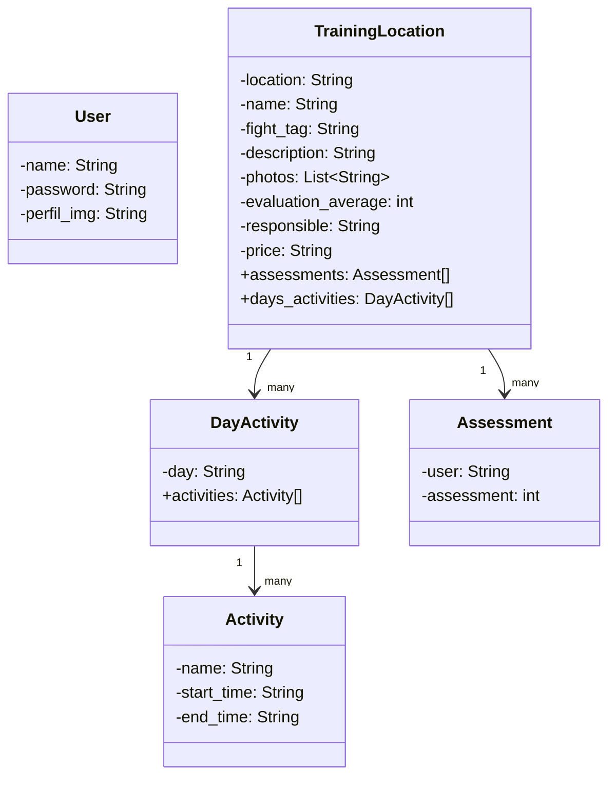

# training-location-API
Uma API para localizar e avaliar locais para treinar lutas.

Cloudinary para upload de imagens.

BD_HOST=postgres.railway.internal
BD_PORT=5432
DB_NAME=railway
DB_USER=postgres
DB_PASSWORD=HAyUmdOHDORJOKCFHvdwOBVyEDKhFIdz
TOKEN_SECRET=banana

